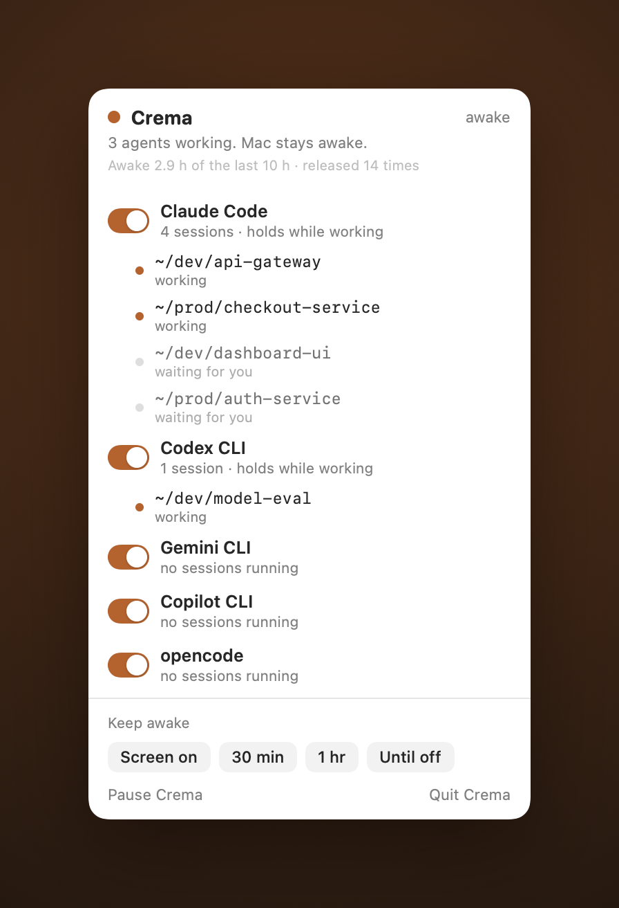

# Crema

**Keep your Mac awake while your AI coding agents are working, and let it sleep the moment they are done.**

<p align="center"></p>

Crema is a menu bar app for macOS. It is a `caffeinate` you can actually see, and an [Amphetamine](https://apps.apple.com/us/app/amphetamine/id937984704) alternative built for a newer problem: you now run coding agents all day, in a dozen terminals, and "is anything still running" is a question you ask constantly.

The old keep-awake tools answer the wrong question. They know whether *you* clicked a toggle. They do not know whether Claude Code is mid-turn in one window while three others sit waiting for your next prompt. Crema does.

> How do I keep my Mac awake while Claude Code (or Codex, or Gemini) runs, without leaving it awake all night? That is the question Crema exists to answer.

## What it does

- **Shows its receipts.** A rolling ledger in the popover: how long Crema actually held the Mac awake over the last day, and how many times it let go. A keep-awake app should be able to prove it lets your Mac sleep.
- **Holds the Mac awake while any watched agent is mid-turn.** When every agent goes quiet, a short grace window runs out and the Mac is free to sleep. Per session, not per app: one agent working keeps you awake while the rest sit idle.
- **Shows working vs waiting.** The popover lists each session, its folder, and whether it is working or waiting for you. The menu bar count is agents mid-turn. When it hits zero, everything is waiting on you.
- **Hold it yourself too.** All agents finished but you are still reading the diff? Keep the Mac awake for 30 minutes, an hour, or until you turn it off. Screen on mode also stops the display from dimming.
- **Pause.** One click and Crema stops holding; the Mac sleeps on its normal schedule until you resume.
- **Watches any process, not just agents.** ffmpeg, rsync, a long build: add a rule for "while it runs." Agents get "while it is working."

Claude Code ships as a preset that is on by default. Nothing to configure before it is useful.

## See it work

<p align="center"></p>

## Why not just use caffeinate, Amphetamine, or KeepingYouAwake?

| Tool | What it does | What it misses |
| --- | --- | --- |
| [`caffeinate`](https://ss64.com/mac/caffeinate.html) | The built-in CLI. Holds a power assertion until you kill it. | Invisible. You forget which terminal ran it, and you cannot see the rest. |
| [Amphetamine](https://apps.apple.com/us/app/amphetamine/id937984704) | Rich triggers, including "while an app runs." | Manages only its own assertion. No per-session agent view. |
| [KeepingYouAwake](https://github.com/newmarcel/KeepingYouAwake) | A clean menu bar toggle over caffeinate. | A toggle, not a monitor. It cannot tell working from waiting. |
| [Caffeine](https://www.caffeine-app.net/) | The 2006 original. On or off. | Same. |

None of them know the difference between an agent working and an agent waiting for you, which for an all-day agent user is the whole question.

## Install

Via Homebrew:

```bash
brew install --cask karanb192/tap/crema
```

Builds are Developer ID signed and notarized, so the app opens first try with no
Gatekeeper hoops. Apple Silicon only.

Or build from source (Xcode 15+ / Swift 5.9+):

```bash
git clone https://github.com/karanb192/crema.git
cd crema
make run      # builds a release .app and launches it
```

The cup appears in your menu bar. There is no Dock icon and no window; it is a background menu bar app.

## How it works

- **Power** is a single [`IOPMAssertionCreateWithName`](https://developer.apple.com/documentation/iokit/1557134-iopmassertioncreatewithname) assertion, the same call `caffeinate` makes. One assertion, many reasons.
- **Turn detection** has two signals. For Claude Code, Crema watches the session transcript files it appends to while mid-turn (`~/.claude/projects`), which stays precise even when the agent is network-bound and burning no CPU. Every other agent, preset or custom, uses a CPU heuristic via `libproc`: an agent mid-turn burns CPU and spawns tool subprocesses, a waiting agent sits near zero, and a short sticky window keeps streaming pauses from flapping the state.
- **Attribution** walks each process for its working directory, so a session shows as its folder, not a bare pid.

The engine lives in `CremaCore` and is covered by unit tests, including an integration test that creates a real assertion and confirms macOS lists it via `pmset -g assertions`.

```bash
make test
```

## Agents supported

Presets ship for the agents below. Claude Code gets the precise per-session turn signal (transcript writes); the rest currently use the CPU heuristic, with their precise signals on the roadmap. Anything else you name in a custom rule works through the CPU signal too.

| Agent | Process | Preset |
| --- | --- | --- |
| [Claude Code](https://github.com/anthropics/claude-code) | `claude` | yes |
| [Codex CLI](https://github.com/openai/codex) | `codex` | yes |
| [Gemini CLI](https://github.com/google-gemini/gemini-cli) | `gemini` | yes |
| [Copilot CLI](https://github.com/github/copilot-cli) | `copilot` | yes |
| [opencode](https://github.com/sst/opencode) | `opencode` | yes |
| Anything else | any | custom rule |

## Status

Early but solid. The power engine and detection are unit-tested and in daily use; releases are Developer ID signed and notarized. Next up: precise turn signals for Codex, Gemini, Copilot and opencode, and a radar for power assertions Crema does not own (that stray hand-started `caffeinate`).

## License

MIT. See [LICENSE](LICENSE).
